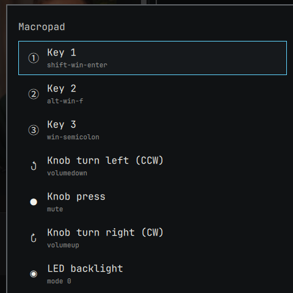

# omarchy-macropad




Remap a cheap 3-key RGB macropad (ch57x/CH552G family, e.g. USB `1189:8890` —
sold under many AliExpress brand names) without touching a config file or
Windows software: pick a key or the knob from a menu, see what it's
currently set to, press the real shortcut you want assigned, and confirm.
Done. Also lets you cycle the LED backlight and see the change live.

Two ways to install it — pick one.

## Option A: one-command setup (recommended)

```sh
git clone https://github.com/EDDARI/omarchy-macropad.git
cd omarchy-macropad
./install.sh
```

Installs `ch57x-keyboard-tool` (AUR) and the Python deps if missing, copies
the scripts to `~/.local/bin`, adds a `SUPER + M` Hyprland keybinding, and
drops a default `~/.config/ch57x-keyboard/mapping.yaml` if you don't already
have one. Safe to re-run.

Uninstall with `./uninstall.sh`.

## Option B: `omarchy plugin add`

This repo doubles as a native Omarchy shell "menu" plugin (`manifest.json` +
`Macropad.qml`), so it can also be loaded straight into the running shell:

```sh
omarchy plugin add https://github.com/EDDARI/omarchy-macropad.git --enable
```

**This only gets you the picker UI** — `omarchy plugin add` clones the repo,
validates the manifest, and toggles it on inside `omarchy-shell`. By design
it never runs install scripts or touches your Hyprland config (see
`omarchy-shell`'s own docs: *"The installer never runs plugin code, install
hooks, or sudo"*). So two things are still on you:

1. **Dependencies** — install these yourself, once:
   ```sh
   yay -S --needed ch57x-keyboard-tool
   sudo pacman -S --needed python-evdev python-yaml
   ```
   (replug the macropad afterwards so the AUR package's udev rule applies)
2. **A keybinding** — the plugin doesn't summon itself. Add a line like this
   to `~/.config/hypr/bindings.lua`:
   ```lua
   o.bind("SUPER + M", "Macropad remap", "omarchy-shell shell toggle eddari.macropad")
   ```

Update with `omarchy plugin update eddari.macropad`, remove with
`omarchy plugin remove eddari.macropad`. Also adds a bar icon (⌨) you can
click instead of pressing `SUPER + M` — enable it with `omarchy bar move
eddari.macropad --section right` (or any section), or from **Bar Settings**.

Don't run both options — they'd fight over the same `SUPER + M` binding.

## How it works

- **Option A's trigger** (`bin/omarchy-macropad-remap`) shows an
  `omarchy-menu-select` popup outside the shell process.
- **Option B's picker** (`Macropad.qml`) is a native Quickshell menu running
  inside `omarchy-shell` itself, with an optional bar-icon launcher
  (`BarWidget.qml`).
- Either lists the six controls with what they're **currently** mapped to
  (e.g. `Key 1 → win-k`), so you can see what you're about to change.
- Picking a control spawns `omarchy-macropad-apply.py capture <slot>`, which
  listens on your real keyboard(s) via `python-evdev` for the next
  key/combo you press and converts it to
  [`ch57x-keyboard-tool`](https://github.com/kriomant/ch57x-keyboard-tool)'s
  key-name syntax. Press `Esc` alone during capture to cancel — capture
  reads raw input devices directly, so this works regardless of what has
  keyboard focus.
- **Nothing is written yet.** You're shown `Key 1 → win-c` and asked to
  confirm (`Enter`) or back out (`Esc`). Only on confirm does
  `omarchy-macropad-apply.py apply <slot> <token>` write
  `~/.config/ch57x-keyboard/mapping.yaml` and run `validate` + `upload`
  against the device, notifying success or failure via `notify-send`. A
  capture with no explicit confirmation step never touches your mapping.

The device only supports one layer (no layer-switch button), so this covers
the 3 keys and the knob's turn-left/press/turn-right actions — six
remappable controls total, plus a seventh **LED backlight** entry.

### LED backlight

`ch57x-keyboard-tool` also exposes a `led <mode>` command
(`ch57x-keyboard-tool led --help`), and this device (`1189:8890`) accepts it.
There's no public documentation of what each mode number looks like for this
specific board — the tool just forwards the raw integer and the firmware
picks an effect, silently accepting any value. So instead of a static list of
named colors, picking **LED backlight** from the menu opens a live
**Next ▶ / ◀ Previous** cycle: each step sends the next mode straight to the
device so you can watch the backlight change in real time and stop
wherever you like (`Enter`/`Esc` to confirm and close, arrow keys to keep
cycling). The last mode you land on is remembered
(`~/.config/ch57x-keyboard/led_mode`) and shown next to the menu entry.

### A different ch57x-family board

If your board enumerates under a different USB vendor/product id than the
common `1189:8890`, override it — no source edits needed:

```sh
export MACROPAD_VENDOR_ID=0x1189   # decimal or 0x-hex, passed to evdev filtering
export MACROPAD_PRODUCT_ID=0x8890  # optional, forwarded to ch57x-keyboard-tool
```

Set these in your shell profile (for Option A) or in `omarchy-shell`'s
environment (for Option B, e.g. via Hyprland's `env =` directives) before
the tool runs.

## Editing macros directly

For multi-key macro sequences the capture tool can't produce, edit
`~/.config/ch57x-keyboard/mapping.yaml` by hand and run:

```sh
ch57x-keyboard-tool upload ~/.config/ch57x-keyboard/mapping.yaml
```

## Compatibility

Written for a specific 3-key + 1-knob, no-display board (USB `1189:8890` by
default, override-able — see above), but should work for any device
`ch57x-keyboard-tool` supports — adjust `rows`/`columns`/`knobs` in
`mapping.yaml` and the `slots` list in `Macropad.qml` / `SLOTS` map in
`bin/omarchy-macropad-remap` to match your layout.

## Development

`scripts/validate-manifest.sh .` reimplements Omarchy's own
`omarchy plugin validate` checks so CI can run them without Omarchy
installed; prefer the real `omarchy plugin validate .` when you have it.
CI (`.github/workflows/validate.yml`) also compiles the Python script and
shellchecks the shell scripts on every push and PR.

## License

MIT
